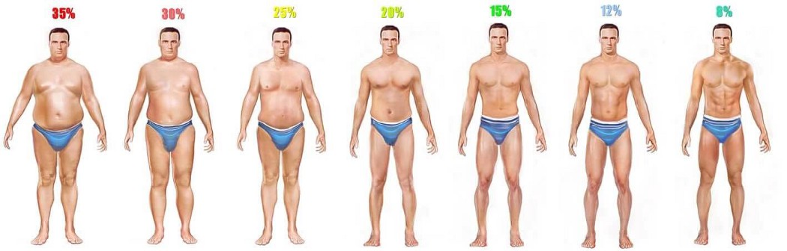

# Bodyfat Estimation
The purpose of this project is to use several clinically available measurements to precisely estimate the percentage of body fat. Our analysis are based on a real data set of **252** men with measurements of their percentage of body fat and various body circumference measurements. 

## Contents of The Repository
There are **three** folders and **two** files in our repository named "Stat628-Module2"
- *data*: we included our original data in this file
- *code*: we included our R code in this file
- *image*: we included images supporting our findings of the analysis in this file
- *Summary.pdf*: This is a two page summary of our procedure of developing this model. The contents include our overall findings, the evidence supporting our findings, and important details of our statistical analysis. 
- *README.md*

## Shiny App Link
https://lofia.shinyapps.io/628_hw2/

## Directions of Using Code
We compliled our program in **R Studio**.
To run our program, you need to follow the steps described below
- Installed packages "*CRAN*", "*kableExtra*", "*tidyverse*", "*reshape*", "*corrplot*", and "*leaps*" in your R Studio
- And then, You need to set up the working directory to "data"(one of the folders under the main directory)
- After you achieved the first two steps, you will be good to run our program :)

## Contributors
- Runshi Tang
- Zixiang Xu
- Zeyu Li

